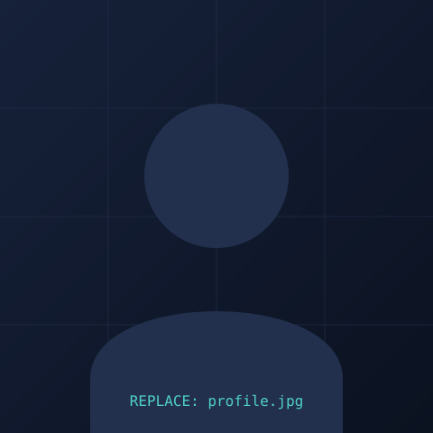

# Manikumar Thote — Portfolio

A personal portfolio site for **Manikumar Thote**, Observability & Infrastructure Analyst,
built with plain HTML, CSS, and JavaScript (no build step, no frameworks).

The design borrows its visual language from a network operations dashboard —
a sticky status bar, log-style experience entries, and module cards for skills —
to reflect the subject matter of the resume it's built from: production
network reliability, observability, and infrastructure engineering.

## Live site

Once deployed (see `DEPLOYMENT.md`), the site will be available at:

```
https://<your-github-username>.github.io/<repository-name>/
```

## What's included

| Section | Content |
|---|---|
| Hero | Name, role, summary, contact links, photo |
| Experience Log | Work history at ICE Data Services and ATOS IT Global Solutions |
| Observability Practice | Dedicated section on monitoring/observability tooling (CA Spectrum, Splunk, Dynatrace, BigPanda) pulled from the current role |
| Security Practice | TryHackMe badge (Advent of Cyber 2025) and profile link, with a commented block ready for a Hack The Box profile |
| Skill Modules | Networking, infrastructure, monitoring, automation, and ITSM skills grouped by category |
| Certifications & Education | CCNA, BigPanda Certified Operator, B.Tech CSE |
| Footer | Contact details |

## Project structure

```
manikumar-portfolio/
├── index.html              # All page content and structure
├── css/
│   └── style.css           # All styling, responsive rules, design tokens
├── js/
│   └── script.js           # Mobile nav toggle, uptime ticker, footer year
├── assets/
│   └── images/
│       └── profile-placeholder.svg   # Replace with your real photo
├── .gitignore
├── README.md
└── DEPLOYMENT.md            # Step-by-step guide to publish this for free
```

## Before you deploy: add your photo

The site currently uses `assets/images/profile-placeholder.svg` as a stand-in.

1. Add your photo to `assets/images/` — ideally a square image, e.g. `profile.jpg`
   (roughly 480×480px or larger, JPG or PNG).
2. Open `index.html`, find the `` tag with `id="profile-photo"`, and change:
   ```html
   
   ```
   to:
   ```html
   
   ```
3. You can delete `profile-placeholder.svg` afterward if you like, or keep it as a fallback.

## Updating your details

Everything is in plain HTML/CSS — no build tools, no npm install, no compiling.

- **Content** — edit the text directly inside `index.html`. Each section is clearly
  commented (`<!-- ===== Experience (log style) ===== -->`, etc.).
- **Colors, fonts, spacing** — all defined as CSS custom properties at the top of
  `css/style.css` under `:root`. Change a value once and it updates everywhere.
- **TryHackMe / Hack The Box** — the Security Practice section has a commented-out
  block ready to uncomment and fill in once you have a Hack The Box profile link.

## Running it locally

No installation needed — it's static HTML/CSS/JS. Either:

- Double-click `index.html` to open it directly in a browser, or
- Serve it locally for a closer-to-production preview:
  ```bash
  # Python 3
  python -m http.server 8000
  # then open http://localhost:8000
  ```

## Deployment

See **`DEPLOYMENT.md`** for the full step-by-step guide to publishing this on
GitHub Pages — free, and available 24/7 from any device, with no server to
maintain.

## Browser support

Works in all modern evergreen browsers (Chrome, Firefox, Safari, Edge) on
desktop and mobile. The layout is fully responsive from small phones up to
large desktop monitors.

## License

This is a personal portfolio project. Feel free to fork the structure for your
own portfolio, but please swap in your own content, photo, and details.
